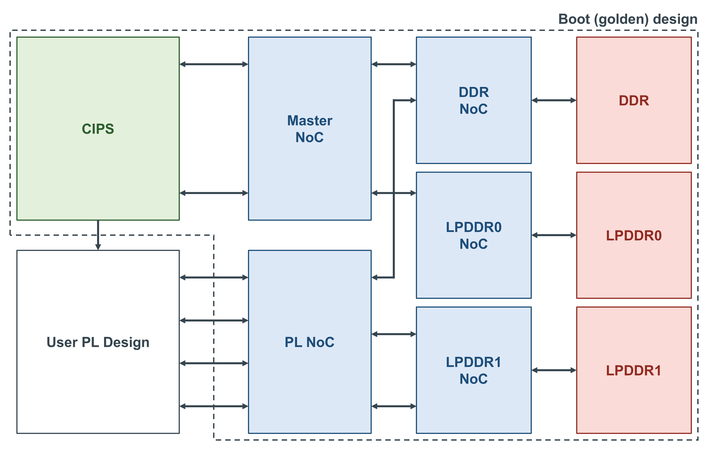

.. _vck190-golden-reference:

Golden Reference Design
=======================

Unlike how PYNQ operates on Zynq UltraScale+ boards, the VCK190 uses Versal segmented
configuration. This means that the configuration of the processors, memory controllers
and Network on Chip (NoC) is programmed at boot-time and cannot be changed. Overlays,
such as the :ref:`vck190-base-overlay`, are then loaded at runtime without re-initializing
the boot configuration.

The processor and memory configuration used in Versal PYNQ images is set by the *golden
reference design*. This reference does not include any user logic; instead, it uses placeholder
IP cores where custom logic should go. Users should build their designs around the golden design,
without changing parameters of the boot configuration. However, it is possible to change the
boot configuration for more sophisticated overlays by changing the ``BOOT.BIN``.

Block Design
------------

The VCK190 golden reference design includes the following:

    * Versal CIPS (Control, Interfaces and Processing System)
    * DDR4, LPDDR0 and LPDDR1 memory controllers
    * NoC configuration connecting the CIPS and PL to memory
    * AXI debug hub
    
The NoC is configured such that the PS has read/write access to both the DDR and LPDDR0. All memory
controllers are accessible by the PL. The LPDDR1 controller is used exclusively for PL memory storage.
The NoC configuration exposes 4 AXI ports to the custom PL design. However, users can route more traffic
through these ports using AXI4 Smart Connects. Interfaces that are not used by the golden design are
connected to tie-offs which should be deleted and replaced with custom overlay logic.

The AXI debug hub is included so that users can debug their designs with Integrated Logic Analyzers
(ILAs) using segmented configuration.

PL Clock
^^^^^^^^

The golden design enables a single PL clock ``pl0_ref_clk`` whose frequency is set to 300 MHz.
This should be treated as the *only* boot configuration parameter that users are allowed to change.
PYNQ-Metadata allows PL clocks to be reprogrammed at run-time. For example, the base overlay requests 100 MHz.

Rebuilding the Golden
---------------------

The project files for the golden design can be found here:

.. code-block:: console

   <PYNQ repository>/boards/VCK190/golden

Using Vivado 2025.2, the golden reference design can be rebuilt using the TCL console:

.. code-block:: console

   cd <PYNQ repository>/boards/VCK190/golden
   make
   

Building Overlays
-----------------

The base overlay in ``<PYNQ repository>/boards/VCK190/base`` is a useful reference for building a custom overlay
against the golden design. Its build locks the implementation to ``golden_noc.ncr`` and runs a compatibility
check against the golden reference using ``pr_verify``.